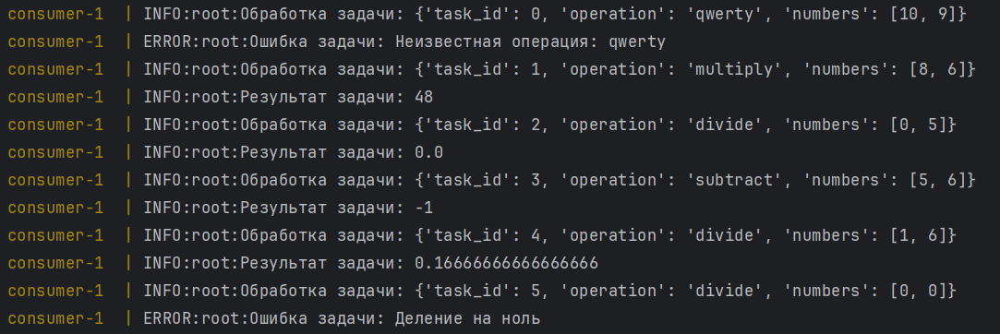
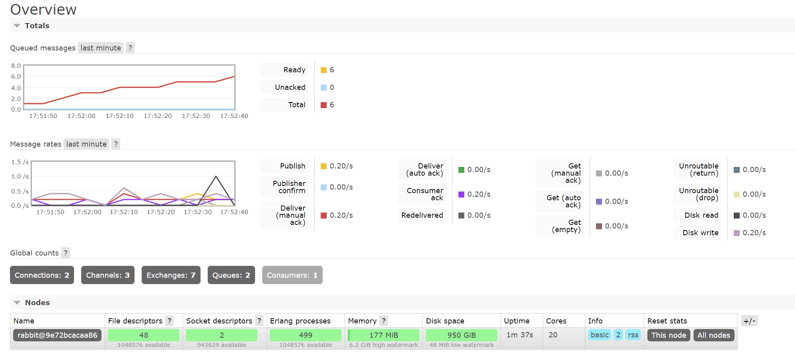

# Simple Pub-Sub App

## Требования
- Docker

## Описание системы

Два приложения на питоне, producer и consumer.
Первый генерирует арифметические задачи и отсылает их второму через RabbitMQ,
а второй принимает сообщение и решает задачу. \
Специально созданы два случая когда возникнет "ошибка" на потребителе и сообщение уйдет в DLQ.

## Установка и запуск

1. Соберите и запустите сервисы:
   ```
   docker-compose up --build

2. Приложение начнет решать задачи и писать лог
3. Посмотреть статистику RabbitMQ можно по адресу http://localhost:15672/

## Скриншоты работы программы

Логи:


Статистика RabbitMQ:
